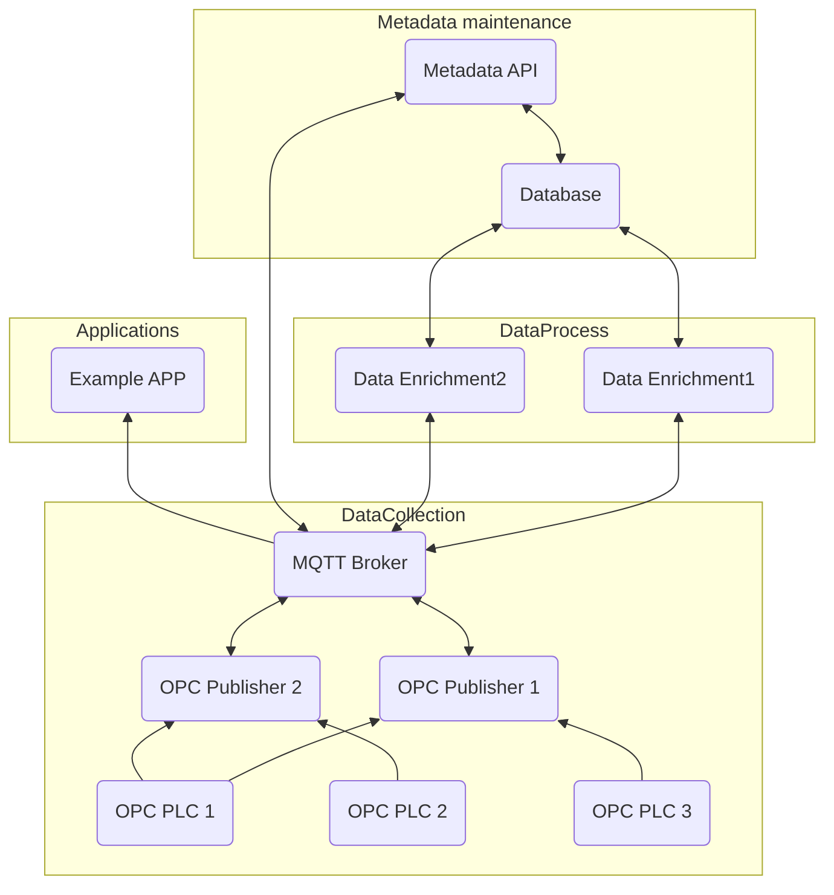

# TelemetryFlow

This project collects telemetry data and after processing them provides
metadata. Based on the following structure:



## Projects

### Manager WebApi project

This project contains the webapi for maintain metadata in the DB and activate subscriptions on the publishers to receive telemetry.

### Models ClassLib

This project will contain the common models used in the DB and the API requests and response.

### Data Classlib

This project will contain the DBContext and the related entity configurations.

### Migrations project

This project will run our Entity Framework migrations to create or update the Database.


## Dev Env

### MSSQL 2022

https://hub.docker.com/_/microsoft-mssql-server

```
host: localhost
user: SA
pass: {provided in Src/dev-env/.env MSSQL_SA_PASSWORD}
```


